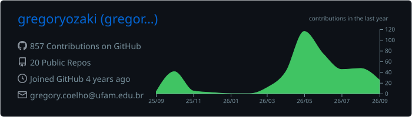
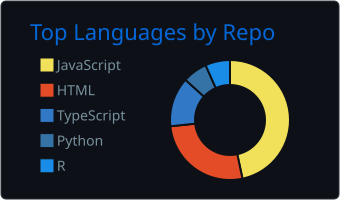
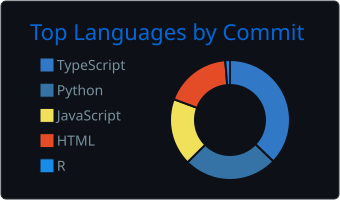
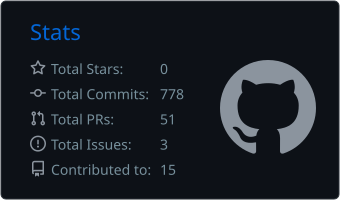
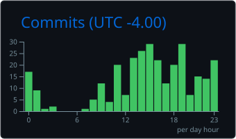

  

# [About Me](./utils/about-me.md)

  I am <strong>Gregory Ozaki</strong>, an Information Systems student at
  <strong>UFAM — ICET/Itacoatiara</strong> and a certified
  <strong>Computer Maintenance and Support Technician</strong> from IFAM.
  I work as a researcher and developer at <strong>NuPeC</strong> and
  <strong>LOGAR</strong>, focusing on Machine Learning, Computer Vision,
  Ethical AI, Data Science, and Robotics. My goal is to apply artificial
  intelligence, optimization, and data analysis to develop practical
  technological solutions with positive social impact.

---

## Currently diving into

<table>
  <tr>
    <td width="220" align="center">
      
    </td>
    <td>
      <ul>
        <li>Machine Learning and Computer Vision</li>
        <li>Full-Stack Web Development</li>
        <li>Advanced Programming Topics</li>
        <li>Computer Networks</li>
        <li>Systems Quality, Security, and Auditing</li>
      </ul>
    </td>
  </tr>
</table>

---

## GitHub metrics

  

  
  
  

  

### Pull requests and issues

  

### Contribution activity

  

  

---

## Technologies and tools

### Languages

  
  
  
  
  
  
  
  
  

### Web development and APIs

  
  
  
  
  
  
  

### Artificial intelligence and data science

  
  
  
  
  
  

### Databases, DevOps, and cloud

  
  
  
  
  
  
  

---

## Connect with me

  
  
  

<picture>
  <source
    media="(prefers-color-scheme: dark)"
    srcset="https://raw.githubusercontent.com/gregoryozaki/gregoryozaki/output/github-contribution-grid-snake-dark.svg"
  >
  <source
    media="(prefers-color-scheme: light)"
    srcset="https://raw.githubusercontent.com/gregoryozaki/gregoryozaki/output/github-contribution-grid-snake.svg"
  >
  
</picture>

 

  

  Created by <a href="https://github.com/gregoryozaki">gregoryozaki</a>.

